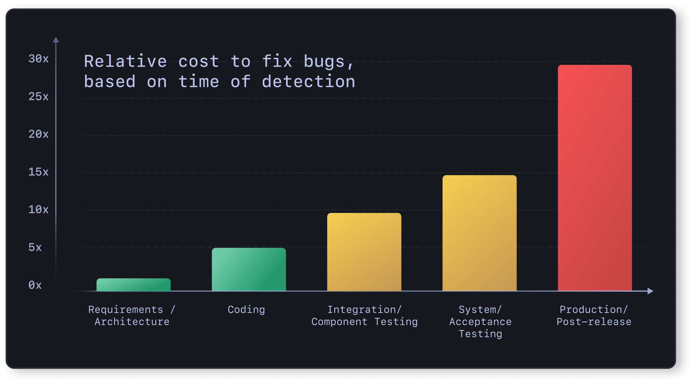

# System Design in Public

## Introduction

This repository is a collection of my learnings in system design, documented in a simple and structured way.

The goal is to build a resource that helps me understand concepts better while also making it easier for others to learn system design without feeling overwhelmed. I’ll be continuously adding new topics as I progress.

If you're also learning system design, feel free to explore and use this as a reference.

💡 Contributions are welcome! If you'd like to improve explanations, fix issues, or add new topics, feel free to open a pull request.

---

## Index

- [What is System Design?](#what-is-system-design)
- [Why is System Design Important?](#why-is-system-design-important)
- [IP (Internet Protocol)](#ip-internet-protocol)
- [IPv4](#ipv4)
- [IPv6](#ipv6)
- [IPv4 vs IPv6](#ipv4-vs-ipv6)

---

## What is System Design?

System design is the process of defining a system’s architecture, components, data flow, and interfaces to meet specific functional and non-functional requirements. It involves identifying how different parts of a system interact with each other to build scalable, reliable, and efficient real-world applications required for business and organizational needs.

---

## Why is System Design Important?

System design is crucial because real-world software systems need to satisfy multiple business and technical requirements. Unlike small or ad-hoc projects, production systems must handle scale, reliability, performance, and maintainability.

Design decisions made in the early stages of development have a significant impact on the overall system. A well-thought-out design helps identify potential issues early, reducing the risk of costly changes later.

If the design is flawed, problems discovered in later stages of development are much more difficult and expensive to fix. This is why investing time in system design upfront is essential for building robust and scalable systems.


---

## How the Internet Works

---

### What is the Internet?

The internet is a global network of interconnected computers (networks) that communicate with each other using standardized protocols.

It can be thought of as a massive system where devices exchange data across the world.

---

### Key Components

- Client → Your device (browser, phone, laptop)  
- Server → Stores and serves data (websites, APIs)  
- ISP (Internet Service Provider) → Connects you to the internet  
- Protocols → Rules for communication (HTTP, TCP/IP)  
- DNS → Converts domain names into IP addresses  

---

### High-Level Flow

When you visit a website:

1. You type a URL (e.g., `google.com`)  
2. DNS converts it to an IP address  
3. The request travels through the internet  
4. The server processes the request  
5. The server sends back a response  
6. The browser renders the webpage
---

## IP (Internet Protocol)

IP (Internet Protocol) is a set of rules that defines how data is formatted and transmitted over a network, whether it’s the internet or a local network.

An IP address is a unique identifier assigned to each device on a network. It allows devices to locate and communicate with each other by providing addressing and routing information.

In simple terms, IP addresses help distinguish between different devices such as computers, routers, and servers, enabling data to be sent to the correct destination. They are a fundamental part of how communication happens over the internet.

---

## IPv4

IPv4 (Internet Protocol version 4) is the older version of IP that uses 32-bit addresses to identify devices on a network.

It has a limited number of addresses (~4.3 billion), which led to issues as the internet grew.

---

## IPv6

IPv6 (Internet Protocol version 6) is the newer version designed to solve IPv4 limitations.

It uses 128-bit addresses, providing a massive number of unique addresses and improved features.

---

## IPv4 vs IPv6

| Feature | IPv4 | IPv6 | Explanation |
|--------|------|------|-------------|
| Address Length | Smaller | Much larger | IPv4 has fewer possible addresses, while IPv6 can support a huge number of devices |
| Address Example | 102.22.192.181 | 2001:0db8:85a3:0000:0000:8a2e:0370:7334 | Shows how IPv4 uses only numbers while IPv6 uses numbers and letters |
| Address Format | Numbers with dots | Numbers + letters with colons | IPv6 format allows many more combinations |
| Total Addresses | Limited | Almost unlimited | IPv4 can run out of addresses, IPv6 solves this problem |
| Device Identification | Sometimes shared | Unique for each device | In IPv4, multiple devices may share an address. NAT (Network Address Translation) allows multiple devices in a private network to share a single public IP address. IPv6 gives each device its own unique address |
| Setup | Needs manual setup or DHCP | Can configure itself | IPv6 can automatically assign an address |
| Communication | Sends to many devices (broadcast) | Sends to specific groups (multicast) | IPv6 avoids unnecessary traffic and is more efficient |
| Speed & Efficiency | Older design | More efficient design | IPv6 is optimized for modern networks |
| Usage | Widely used today | Growing usage | IPv4 is common, IPv6 is the future |

---

## Types of IP Addresses

### Public IP Address

A public IP address is assigned to your network by your Internet Service Provider (ISP) and is used to identify your network on the internet.

- One public IP typically represents your entire home/office network  
- All devices inside the network share this IP when communicating with the internet (via NAT)  

**Example:**  
The IP assigned to your router by your ISP  

---

### Private IP Address

A private IP address is assigned to devices within a local network and is not accessible directly from the internet.

- Each device in the same network gets a unique private IP  
- Used for communication within the network  

**Examples of private IP ranges:**

- 192.168.x.x  
- 10.x.x.x  
- 172.16.x.x – 172.31.x.x  

**Example:**  
Your laptop or phone getting an IP like 192.168.1.5 from the router  

---

### Static IP Address

A static IP address is a fixed IP address that does not change over time.

- Manually configured or reserved  
- More stable and predictable  
- Usually more expensive  

**Used for:**

- Hosting websites or servers  
- Running email servers  
- Remote access systems  
- DNS servers  

**Example:**  
A company server that must always be reachable at the same IP  

---

### Dynamic IP Address

A dynamic IP address is automatically assigned and can change over time.

- Assigned using Dynamic Host Configuration Protocol (DHCP)  
- Most commonly used type  
- Cost-effective and easy to manage  

**Used for:**

- Home users  
- Mobile devices  
- General internet usage  

**Example:**  
Your home router getting a different IP from the ISP periodically  
---

## Domain Name System (DNS)

We learned that IP addresses enable computers to communicate with each other. However, for humans, it is much easier to remember names instead of numerical IP addresses.

For example, it is easier to remember `google.com` than `142.251.39.142`.

To solve this problem, we use DNS (Domain Name System), which is a **hierarchical and decentralized naming system** used to translate human-readable domain names into IP addresses.

---

## Why is DNS Hierarchical?

DNS is hierarchical because it is organized like a **tree structure**, not a flat list.

### Structure
```
. (Root)
├── .com
│ ├── google.com
│ ├── amazon.com
│
├── .org
│ ├── wikipedia.org
```

---

### Why this structure?

#### 1. Scalability

- There are billions of domain names  
- A flat system would be impossible to manage  

Hierarchy divides responsibility across levels.

---

#### 2. Delegation of Control

- Root handles `.com`, `.org`, etc.  
- `.com` manages `google.com`, `amazon.com`  

Each level is responsible for managing its own part.

---

#### 3. Faster Lookup

Instead of searching everywhere:

- Root → `.com` → `google.com`  

This step-by-step approach makes lookup efficient.

---


---

## Why is DNS Decentralized?

DNS is decentralized because:

- There is no single server that stores all domain mappings  
- Instead, data is distributed across many servers worldwide  

---

### Why decentralization?

#### 1. Reliability (No Single Point of Failure)

- If one DNS server fails, others still work  
- The internet remains functional  

---

#### 2. Scalability

- Millions of DNS queries happen every second  
- A single server cannot handle this load  

Load is distributed across multiple servers globally.

---

#### 3. Performance (Low Latency)

- DNS servers are located across the world  
- Queries are routed to the nearest server  

This reduces response time.

---

#### 4. Ownership & Control

- Different organizations manage their own domains  

**Examples:**

- Google manages `google.com`  
- Amazon manages `amazon.com`  

There is no single central authority controlling all domains.

---

## How DNS Works

DNS lookup involves the following steps:

1. A user types `example.com` into a browser  
2. The request is sent to a DNS resolver  
3. The resolver queries a DNS root server  
4. The root server responds with the address of a TLD server (e.g., `.com`)  
5. The resolver queries the TLD server  
6. The TLD server returns the address of the domain’s authoritative server  
7. The resolver queries the authoritative server  
8. The authoritative server returns the IP address  
9. The resolver sends the IP back to the browser  

---

Once the IP address is resolved, the client can send a request to the server, and the server responds with the required content (e.g., a webpage).


---

## DNS Server Types

### DNS Resolver

A DNS resolver is the first step in a DNS query. It acts as a middleman between the client and DNS nameservers.

- Receives the query from the client  
- Checks cache for existing data  
- If not found, queries:
  - Root nameserver  
  - TLD nameserver  
  - Authoritative nameserver  

Finally, it returns the IP address to the client.

---

### DNS Root Server

A root server handles queries from the resolver and directs it to the appropriate TLD server based on the domain extension (e.g., .com, .org).

- Managed by ICANN (Internet Corporation for Assigned Names and Numbers)  
- There are 13 logical root servers globally  
- Each has multiple physical servers worldwide using Anycast routing  

---

### TLD (Top-Level Domain) Server

A TLD server stores information for domains under a specific extension.

Examples:
- `.com`, `.org`, `.net` (generic TLDs)  
- `.uk`, `.us`, `.jp` (country-code TLDs)  

- Managed by IANA (part of ICANN)  
- Directs queries to the domain’s authoritative server  

---

### Authoritative DNS Server

The authoritative server contains the actual DNS records for a domain.

- Final step in DNS lookup  
- Returns:
  - IP address (A record)  
  - Or alias (CNAME)  

If the domain does not exist, it returns an **NXDOMAIN** response.

---

## DNS Query Types

DNS queries define how a domain name is resolved and who performs the work.

### Recursive Query

The resolver performs all the work and returns the final answer to the client.

---

### Iterative Query

- Server returns the best possible answer  
- If not known, it provides a referral  
- Client continues querying other servers  

---

### Non-Recursive Query

- Resolver already has the answer (cached or authoritative)  
- Returns result immediately  

---

## DNS Record Types

DNS records (zone files) define how a domain behaves.

They specify:
- Which IP address a domain maps to  
- How requests should be handled  

---

### What is inside a DNS Record?

Each record contains:

- Name → Domain/subdomain  
- Type → Record type  
- Value → Data (IP/domain)  
- TTL → Cache duration  

---

### TTL (Time-To-Live)

- Defines how long a record is cached  
- Lower TTL → Faster updates  
- Higher TTL → Better performance  

---

### Common DNS Records

- A → Maps domain to IPv4  
- AAAA → Maps domain to IPv6  
- CNAME → Domain alias  
- MX → Mail server  
- TXT → Metadata / verification  
- NS → Name server  
- SOA → Admin info  
- SRV → Service + port  
- PTR → Reverse lookup  
- CERT → Security certificates  

---

## Subdomains

A subdomain is an extension of a main domain used to organize content.

**Example:**
- `blog.example.com`  
  - blog → subdomain  
  - example → main domain  
  - .com → TLD  

Other examples:
- `support.example.com`  
- `careers.example.com`  

---

## DNS Caching

A DNS cache is a temporary storage of recent DNS lookups.

- Stored by OS or resolver  
- Improves performance by avoiding repeated lookups  

Each record has a TTL:
- TTL decreases over time  
- When it reaches zero → record is removed  
- Next request triggers fresh DNS lookup  

---

## Reverse DNS

Reverse DNS maps an IP address back to a domain name.

- Uses PTR records  
- Opposite of normal DNS lookup  

---

### Use Cases

- Email servers verify sender authenticity  
- Security and logging  

---

### Note

Reverse DNS is not mandatory and is not used for general web browsing.
---

## TCP and UDP

---

## TCP (Transmission Control Protocol)

Transmission Control Protocol (TCP) is a **connection-oriented protocol** used for reliable communication between devices over a network.

---

### What does “connection-oriented” mean?

Before sending data, TCP establishes a connection between sender and receiver.

- Ensures both sides are ready  
- Creates a reliable communication channel  

---

### How TCP Works (High-Level)

1. Connection is established (3-way handshake)  
2. Data is sent in packets  
3. Receiver acknowledges received packets  
4. Connection is closed after communication  

---

### Key Features of TCP

#### Reliable Data Transfer

- Ensures all data reaches the destination  
- Retransmits lost packets  

---

#### Ordered Delivery

- Packets are delivered in the same order they were sent  

---

#### Error Checking

- Detects corrupted or lost data  
- Ensures data integrity  

---

#### Flow Control

- Prevents sender from overwhelming the receiver  

---

#### Congestion Control

- Adjusts data flow based on network conditions  

---

### Where is TCP used?

TCP is ideal for applications where accuracy and reliability are critical:

- Web pages (HTTP/HTTPS)  
- File transfers  
- Emails  
- APIs  

---

### Tradeoff

While TCP is reliable, its feedback mechanisms introduce higher overhead and increased bandwidth usage.

---

## UDP (User Datagram Protocol)

User Datagram Protocol (UDP) is a **connectionless protocol** used for fast data transmission over a network.

Unlike TCP, UDP does not establish a connection and does not guarantee delivery.

---

### What does “connectionless” mean?

- No connection setup (no handshake)  
- Data is sent directly to the receiver  
- No confirmation if data is received  

---

### How UDP Works

- Sender sends packets (datagrams)  
- No acknowledgment is received  
- No retransmission if packets are lost  

Data is sent continuously, regardless of delivery status.

---

### Key Features of UDP

#### Fast Transmission

- No connection setup overhead  
- Lower latency compared to TCP  

---

#### No Reliability

- Packets may be lost  
- No retransmission  

---

#### No Ordering Guarantee

- Packets may arrive out of order  

---

#### No Congestion Control

- Does not adjust based on network conditions  

---

### Where is UDP used?

UDP is preferred when speed is more important than reliability:

- Live video streaming  
- Online gaming  
- Voice/video calls  
- DNS queries  

---

### Tradeoff

- Very fast  
- No guarantee of delivery, order, or correctness  

---

## TCP vs UDP

| Feature | TCP | UDP |
|--------|-----|-----|
| Connection | Requires connection | Connectionless |
| Delivery Guarantee | Yes | No |
| Retransmission | Yes | No |
| Speed | Slower | Faster |
| Broadcasting | Not supported | Supported |
| Use Cases | HTTP, HTTPS, FTP, SMTP | Streaming, DNS, VoIP |

---

## HTTP & HTTPS

---

## What is HTTP?

HTTP (HyperText Transfer Protocol) is a protocol used for communication between a client (browser) and a server.

- Follows a request–response model  
- Stateless (each request is independent)  

---

### How HTTP Works

1. Client sends a request to the server  
2. Server processes the request  
3. Server sends back a response  

---

### Key Features of HTTP

- Stateless  
- Fast (no encryption overhead)  
- Flexible (supports HTML, JSON, images, files)  

---

### Limitations of HTTP

- No encryption  
- Data can be intercepted  
- Not suitable for sensitive data  

---

## What is HTTPS?

HTTPS (HyperText Transfer Protocol Secure) is HTTP with encryption using SSL/TLS.

---

### How HTTPS Works

1. Client connects to server  
2. SSL/TLS handshake is performed  
3. Secure connection is established  
4. Data is transmitted in encrypted form  

---

### Features of HTTPS

- Encryption (protects data)  
- Authentication (verifies server identity)  
- Integrity (prevents tampering)  

---

## HTTP vs HTTPS

| Feature | HTTP | HTTPS |
|--------|------|-------|
| Security | No | Yes |
| Encryption | No | Yes (SSL/TLS) |
| Port | 80 | 443 |
| Performance | Faster | Slightly slower |
| Use Case | Non-sensitive data | Secure communication |

---

### When to Use HTTPS

- Login systems  
- Payment systems  
- APIs  
- Any application handling user data  

Modern systems should always use HTTPS.

---

## HTTP Versions (Overview)

- HTTP/1.1 → Persistent connections  
- HTTP/2 → Multiplexing  
- HTTP/3 → Uses UDP (QUIC), lower latency  
